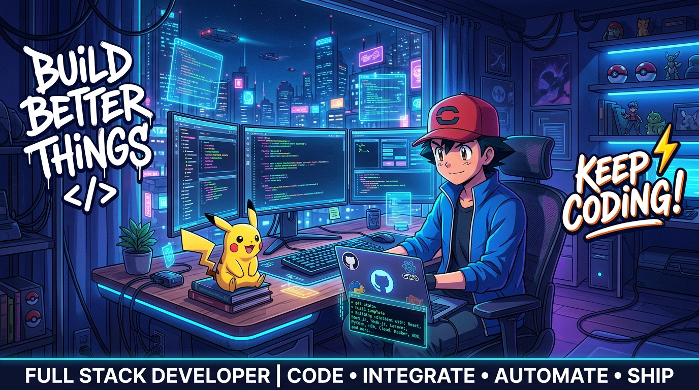
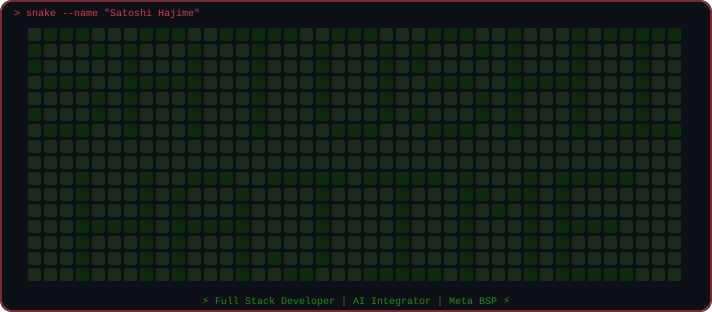

<div align="center">

<!-- BANNER -->


<br/>

<!-- RUNNING TEXT / TYPING ANIMATION -->
[](https://github.com/SatoshiHajime)

<br/>

<!-- BADGES -->

&nbsp;

&nbsp;

&nbsp;

&nbsp;


</div>

---

## 🎮 `> whoami`

```bash
$ whoami

  Name        : Satoshi Hajime
  Role        : Full Stack Developer & AI Integrator
  Location    : Jakarta, Indonesia 🇮🇩
  Focus       : Web Apps | ERP/CRM Systems | AI Automation | Omnichannel
  Speciality  : Meta BSP | WhatsApp Cloud API | Messaging Platform Integration
  Workflow    : 🎧 100% Vibe Coding (Flow State + AI Symbiosis)
  AI Engines  : Google Antigravity ✕ GPT-6 Astra
  Philosophy  : "Build Better Things. Better Code, Better Tomorrow."
  Status      : Always in flow, always shipping ⚡
```

<div align="center">

> 💡 *Turning ideas into real solutions — Building scalable web apps, omnichannel platforms, integrating AI systems, and shipping products that matter.*

</div>

---

## ⚡ `> about --me`

- 🔭 &nbsp; Sedang membangun **platform ERP/CRM, omnichannel messaging, dan tools berbasis AI**
- 🎧 &nbsp; **100% Vibe Coder**: Seringkali ide gila jadi produk nyata dalam semalam karena *flow state* tinggi dibantu **Google Antigravity** & **GPT Astra** ⚡
- 📱 &nbsp; Spesialisasi **Meta Developer BSP** — WhatsApp Cloud API, Instagram Messaging & Facebook Platform integration
- 🤖 &nbsp; Passionate tentang **Integrasi AI** — dari n8n automation hingga autonomous AI agent workflows
- 🌱 &nbsp; Terus explore **AI/ML, LLM integration, & workflow automation**
- 🛠️ &nbsp; Expert di **sistem nyata**: shipment management, admin platforms, & digital agencies
- ⚡ &nbsp; Fun fact: **Pikachu yang ngoding, saya yang di-debug-in** 😄
- 📫 &nbsp; Reach me: **@ashento-documentation**

---

## 🎧 `> mode --vibe-coding`

<div align="center">

```
╔══════════════════════════════════════════════════════════════════════╗
║               🎧  V I B E   C O D I N G   M O D E  ⚡                 ║
╠══════════════════════════════════════════════════════════════════════╣
║  "Coding at the speed of thought. You bring the architecture,        ║
║   business logic & vision — let AI amplify the speed & execution."   ║
║                                                                      ║
║  Flow State  : [████████████████████████████████████] 100% OPTIMAL   ║
║  AI Engines  : Google Antigravity ✕ GPT-6 Astra                      ║
║  Motto       : Code by Vibes, Ship with Engineering Precision 🚀     ║
╚══════════════════════════════════════════════════════════════════════╝
```

> 💡 *Terkadang solusi terbaik lahir bukan dari berhari-hari pusing mikirin boilerplate, tapi lewat **Vibe Coding**: berada di flow state terbaik, berkolaborasi dengan AI cerdas (Google Antigravity & GPT Astra), dan langsung nge-ship produk ke production!* 🚀

</div>

---

## 📱 `> meta --developer & omnichannel`

<div align="center">

```
╔══════════════════════════════════════════════════════════════╗
║          META DEVELOPER  ·  BSP CERTIFIED  ·  OMNICHANNEL   ║
╠══════════════════════════════════════════════════════════════╣
║  > Connecting businesses to billions of users via Meta       ║
║  > WhatsApp Cloud API · Instagram · Messenger · Threads      ║
╚══════════════════════════════════════════════════════════════╝
```

| Platform | Capability | Status |
|:---:|:---:|:---:|
|  | BSP Integration, Broadcast, Chatbot | 🟢 Production |
|  | DM Automation, Story Reply | 🟢 Active |
|  | Chatbot & Customer Automation | 🟢 Active |
|  | Graph API, Webhooks, Lead Ads | 🟢 Active |
|  | Multi-platform Automation Pipeline | 🟢 Active |

</div>

```javascript
// 📱 Omnichannel Architecture
const OmnichannelStack = {
  bsp_partner   : "Meta Business Solution Provider",
  channels      : ["WhatsApp", "Instagram", "Messenger", "Threads"],
  capabilities  : ["Cloud API", "Webhooks", "Broadcast", "AI Chatbot", "CRM Sync"],
  use_cases     : [
    "Customer Support Automation 🤖",
    "Marketing Broadcast Campaigns 📣",
    "AI-powered Sales Assistant 💼",
    "Order Tracking via Chat 📦",
    "Lead Nurturing Pipeline 🎯",
  ],
  status: () => console.log("⚡ All channels connected. Ready to serve millions.")
};

OmnichannelStack.status();
// ⚡ All channels connected. Ready to serve millions.
```

---

## 🤖 `> AI --integrations`

<div align="center">

| AI Stack | Use Case | Status |
|:---:|:---:|:---:|
|  | Agentic Coding Assistant & IDE Pair | 🟢 Daily Driver |
|  | Autonomous AI Agent & Deep Reasoning | 🟢 Active |
|  | Workflow Automation & AI Pipelines | 🟢 Active |
|  | LLM Integration & Chatbot | 🟢 Active |
|  | AI Assistant Integration | 🟢 Active |
|  | AI Agent & RAG Systems | 🔵 Exploring |
|  | ML Model Deployment | 🔵 Exploring |

</div>

```python
# 🤖 AI Integration & Vibe Coding Philosophy
class SatoshiAI:
    def __init__(self):
        self.belief = "AI bukan pengganti developer — AI adalah senjata developer"
        self.mode   = "🎧 100% Vibe Coding (Flow State + AI Pairing)"
        self.stack  = ["Google Antigravity", "GPT Astra", "n8n", "OpenAI", "Gemini", "LangChain"]
        self.goal   = "Automate the boring. Build what matters."

    def build(self, idea):
        return f"⚡ {idea} → Vibe Coded with AI → Shipped to Production 🚀"

me = SatoshiAI()
print(me.build("Your next big project"))
# Output: ⚡ Your next big project → Vibe Coded with AI → Shipped to Production 🚀
```

---

## 🛠️ `> tech --stack`

<div align="center">

### 🎨 Frontend
<p>

</p>

### ⚙️ Backend
<p>

</p>

### 🗄️ Database
<p>

</p>

### 🔧 Tools & DevOps
<p>

</p>
<p>

&nbsp;

&nbsp;&nbsp;

&nbsp;

</p>

### 📱 Messaging & Omnichannel
<p>

&nbsp;

&nbsp;

&nbsp;

&nbsp;

</p>

### 🤖 AI & Automation
<p>

&nbsp;

&nbsp;

&nbsp;

</p>

</div>

---

## 📊 `> github --stats`

<div align="center">


&nbsp;&nbsp;


<br/>


<br/>


</div>

---

## 🏆 `> github --trophies`

<div align="center">


</div>

---

## 🐍 `> mini-game --snake-name`

<div align="center">

> ⚡ *Snake makan kontribusi sambil nulis nama — Powered by pixel art & CSS animation!*



> 🎮 *Watch the neon green snake trace through every pixel of **SATOSHI HAJIME**...*

</div>

---

## 🎯 `> current --projects`

<div align="center">

| Project | Description | Stack | Status |
|:---|:---|:---|:---:|
| 🚢 **Shipyard ERP** | Platform manajemen logistik & shipment | Laravel, Vue, MySQL | 🟢 Live |
| 🤖 **Jadi Admin** | AI-powered CRM + Admin Remote + Omnichannel | Next.js, Node.js, WhatsApp API | 🔵 In Dev |
| 📦 **AssetHub** | Sistem manajemen aset digital & dokumentasi | React, Firebase | 🟡 Beta |
| 🖨️ **Printflow** | Manajemen produksi & percetakan | Laravel, Vue, MySQL | 🟢 Live |
| 📊 **SAN CRM** | Agency management + Omnichannel messaging | Next.js, MongoDB, Meta API | 🔵 In Dev |

</div>

---

## 🌐 `> connect --social`

<div align="center">

[](https://github.com/SatoshiHajime)
&nbsp;
[](https://linkedin.com/in/satoshihajime)
&nbsp;
[](https://wa.me/6285870276890)
&nbsp;
[](mailto:satoshi@ashento.dev)
&nbsp;
[](https://www.instagram.com/thereal_sandika/)

<br/><br/>

[](https://github.com/SatoshiHajime)

</div>

---

<div align="center">


</div>